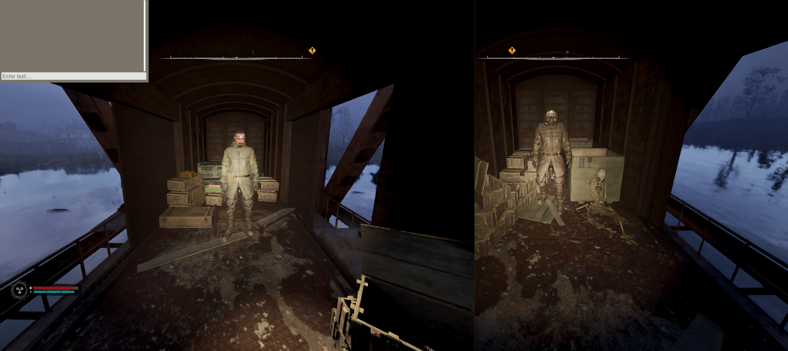

# Multiplayer Mod for S.T.A.L.K.E.R. 2

This mod adds multiplayer functionality to **S.T.A.L.K.E.R. 2**, allowing players to interact within the same game world. Currently, the number of simultaneous connections is limited to **100 players**.

## Features

### Commands:

- **/fly** — activates or deactivates flight mode.  
  *Note*: If you're in flight mode, your position won't load for other players. To fix this, walk into the rendering zone on foot.

- **/tp 1 2 3** — teleports you to the specified coordinates. Replace `1 2 3` with the desired values to move to a specific point on the map.

## Notes

- This mod is designed to enhance the multiplayer experience, and we are continuously working on improving it. New features and bug fixes will be added in the future.

## Launch

1. Run **S2MPLauncher.exe**.
2. In the window that appears, select the game by navigating to **GamePath\Stalker2\Binaries\Win64\Stalker2-Win64-Shipping.exe**.

## Support

If you have any questions or issues, feel free to ask for help via the **Issues** section in the repository.

---

**Enjoy your game and good luck in the Zone!**
